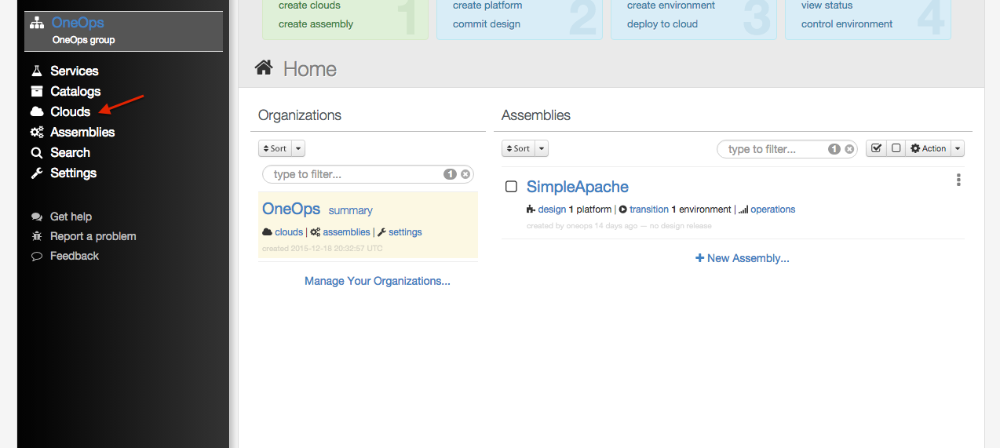
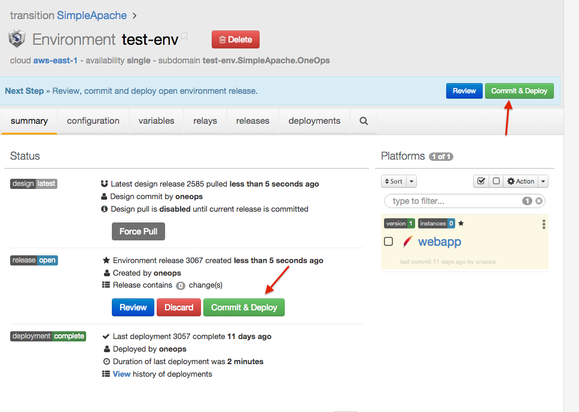

To get started with OneOps installation , you can start with

1. Getting Started with OneOps public [AMI](#geting-started-with-oneops-public-ami)
2. Use [Vagrant](#installing-vagrant-image)

# Getting Started with OneOps public AMI

If you have a AWS account you can bring up a basic version of OneOps using public AMI. (Right now available in US east region). This image have some basic configuration already in place.

## Find OneOps public image

On your EC2 Dashboard make sure you have selected N.Virginia region
In IMAGES/AMIs tab, make sure you select "Public images" in the drop down and search for OneOps. The image with name OneOps-basic-preconf-v1.* is the right one (pick the latest version).

## Launch your instance
1. Select the OneOps AMI and hit Launch.  
2. On the "Instance Type" tab make sure you select m4.large or bigger, OneOps needs at least 8GB of RAM.  
3. On the "Instance Details" is usually ap to you but if you want to have a public ip enable Auto-assign Public IP.  
4. On the "Add storage tab" make sure you have 2 volumes.  
Name you instance  
5. On the "Security group" add rule to open port 3000. OneOps UI is an rails app and runs on this image in development mode so you can check logs and see what's going on under the hood. 
6. Review and launch. When instance comes up, in your browser hit url http://your-public-ip:300
 
If login page comes up you are ready to go, login as oneops/oneops
If not - check the [troubleshooting](#troubleshooting) section.

## Login into OneOps
The AMI have preregistered user *oneops/oneops* within organization "OneOps". Also we have created simple assembly called **SimpleApache**. You can start browsing around.  
But if you want to deploy this test assembly to EC2 cloud you need to provide your credentials

##	Configure Cloud

In the left nav click on Clouds - you will be taken to the list of clouds configured in the system. 

The one we have created for you is aws-east-1. Click on it and go to the cloud detail page.
On the right hand side you will see the list of services this cloud provides.  

For each one of them you will have to provide your access key and secret key.
* Make sure this user has appropriate permissions to manage cloud services (EC2,route53 as the case may be)

Yes you will have to do it for each one of them which is pain, but what if you want to use services from different providers :-)

## Deploy Simple Assembly

We have pre-created simple assembly named *SimpleApache*. This assembly have just one Apache platform with all out of the box default configuration values. You can examine it by clicking Assemblies (left nav) and then on SimpleApache. This will take you to the Assembly summary page which will have pretty much nothing since no activity was performed on this assembly. Click on "Design" (left nav) and you will get to the Assembly Design page where you can review platforms your assembly composed of (just one in this case) and if you click on the platform you will get onto "Platform Design Page". Just browse around.
Next step is to try to deploy this simple assembly:  

Go to "transition" page (left nav). You will see there is one environment already pre-created - "test-env", click on it and get onto Environment detail page. There is same one platform here as it was in design, but it's in disabled state, in order to deploy it you need to enable it. In little drop down menu you can do this.

Next step commit your changes and deploy:

The system will generate the deployment plan with steps that will be executed. Review them and hit deploy:

While deployment is in progress you can click on the steps to expand to work orders (one step can have multiple work orders). And there you can click on the log link to see what's going under the hood.Once deployment is complete you can go to operations page and examine what you have there. Also check your ec2 dashboard to see the result.

##Troubleshooting

 * [Trouble connecting to port 3000](../testing#ui-does-not-come-up)
 * [Deployment fails ](../testing#deployment-fails)
 * Not here , look [here](../testing)
 * We can help :<a href="{{ site.slack_url }}" target="_blank">{{ site.slack_channel }}</a>

# Installing Vagrant Image
Install OneOps using vagrant from [here](https://github.com/oneops/setup)

>Note : As an **admin** you will be responsible for primarily installing OneOps in your **organization** or also responsible for setting
up cloud and services The steps described to create an assembly,platform refers to [User](/../../user) section.

## Outline

2. Setup Vagrant [here](#vagrant-up)
1. Set up *clouds*. Refer screen cast  below . For more details refer   [user](../../user/getting-started/#create-cloud)
   1. Create Clouds
    1. Create Cloud Services
       1. Compute Cloud Service
       2. DNS Cloud Service
       3. GNS Cloud Service
  1. Create Assembly
       1. Create Platform
       2. Create Environment
       3. Deploy an Environment
   

# Vagrant up
1. Install the required software for Vagrant.
   1. [Virtal Box 5](https://www.virtualbox.org/).
   2. [Vagrant](https://www.vagrantup.com/)
2. Execute the following

~~~ bash
   git clone https://github.com/oneops/setup
   cd setup/vagrant
   vagrant up
~~~

The setup does the following :

  * Installs all required software see [here](/admin/key-concepts/#oneops-system-architecture)
  * Sets up minimal data set required for OneOps to work.
  * Clones, Builds and Deploys all the required components to run [OneOps](/admin/key-concepts/#oneops-system-architecture)
  * Bootstraps the  circuits from [circuit-oneops](https://github.com/oneops/circuit-oneops-1/)

~~~ bash

# After the successful install , you wills see this in console.
  ==> default: Done with admin
  ==> default: OneOps should be up on http://localhost:3000
  ==> default: Configure your port forwarding and shut down iptables service (or configure it) if needed
  ==> default: All done at : 15:28:54
~~~

If step fails refer [troubleshooting](../testing).

> UI should be up [here](http://localhost:9090/users/sign_in).

# Set Up your Organization , Clouds, Cloud Services  
 
* Refer [User](../../user/getting-started/#create-cloud) Or see screen cast below.
   

# Check Inductor  [Inductor](../key-concepts#inductor)

> This section is for informative purpose only, The vagrant image has pre-installed and configured inducor ready to 
execute workorder. 

Inductor executes the **workoders/actionOrders** pushed by **controller** to
cloud location specified at cloud creation. Refer [this](../references/#inductor) for overall flow.

## Log on to Vagrant Image

~~~ bash
vagrant ssh
sudo su
cd /opt/oneops/inductor
inductor status 
indcutor tail 
## should show inductor successfuly connected to amq. 

~~~

## Inductor directory Structure
>The directory structure after you have created inductor successfully will look like this, 

~~~ bash
cd /opt/oneops/inductor
├── circuit-oneops-1 -> /home/oneops/build/circuit-oneops-1 from (https://github.com/oneops/circuit-oneops-1)
├── clouds-available # All inductor which are created will go in this
│   └── public.oneops.clouds.aws
├── clouds-enabled
│   └── public.oneops.clouds.aws -> ../clouds-available/public.oneops.clouds.aws
├── Gemfile
├── Gemfile.lock
├── init.d
│   └── inductor
├── lib
│   └── client.ts
├── log
└── shared ## Refer (https://github.com/oneops/oneops-admin/tree/master/lib/shared)
    ├── cookbooks
    ├── exec-gems.yaml
    ├── exec-order.rb
    └── hiera.yaml

~~~

# Validate Set up

Create Assembly, Platforms and environment to test it out. Refer [User](./user/getting-started)
Or
See screen cast below (might work better on the full screen, we are working on improving this).

<iframe src="https://player.vimeo.com/video/154112203" width="200 " height="253" frameborder="0" webkitallowfullscreen mozallowfullscreen allowfullscreen></iframe>

# Before You Begin

Before you begin, read the following documentation. It is the most essential information you need to start well.

* **[Overview:](../)** OneOps business-level description of main benefits versus alternative solutions
* **[Key Concepts:](../key-concepts)** Conceptual description and diagram of how OneOps works
* **[Tools:](../tools)** List of supporting tools and services that can be used with OneOps
* **[Getting Started:](../getting-started)** How to start using OneOps (this section)
* **[Best Practices:](../best-practices)** How you should use OneOps for best results

# What You Will Need When You Work

Refer to the following documentation as you work.

* **[Typical Usage Scenarios:](../typical-scenarios)** How components work together to enable commonly implemented scenarios
* **[References:](../references)** Detailed code usage descriptions with code snippets
* **[Testing & Debugging:](../testing)** Strategic overview description of how to test and debug OneOps
* **[Updates:](../updates)** Release and patch announcements as well as articles of interest to OneOps users
* **[Contribution:](../contribution)** How to provide feedback, report issues, contribute to development, or contact us
