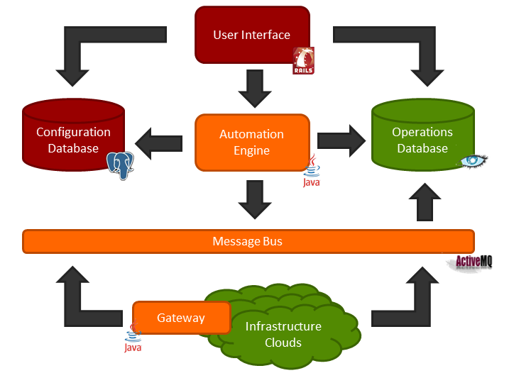
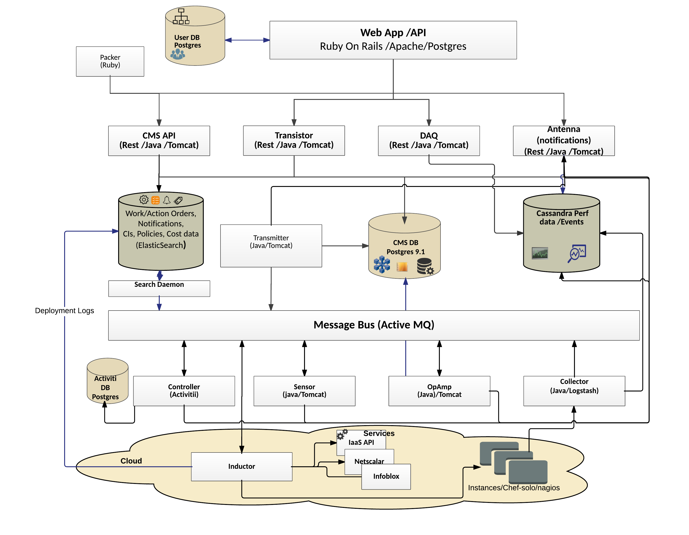

# Architecture Overview
OneOps includes a **self service portal** for users to administer the applications, has a back end **automation engine** to support complete application life cycle management.  

OneOps has a **back end loop** to **monitor** resources and can trigger  **auto-repairs**, **auto-scales** or  **notifications**

# OneOps System Architecture

The diagram below depicts a detailed system architecture .

## Web App aka *display*
* Self service portal for managing **applications, clouds, organization,services**.
* Rest based API's to do almost anything which can be done on UI.
* Can be integrated with sign on from AD
* [View the source](https://github.com/oneops/display)

## CLI
 Command line *ruby gem* for managing almost all aspects of OneOps.
 * [View the source](https://github.com/oneops/cli)

## User DB
*User schema* to manage users, organization.
## Packer/Circuit
Its a ruby based gem which is responsible for loading packs.
*  [View the source](https://github.com/oneops/oneops-admin)

## CMS API aka adapter
 Java based rest api to manage model, assemblies, environment.
*  [View the source](https://github.com/oneops/adapter)

## Transistor

Transistor is core web application responsible for creating design,*deployment* plan, comparing whats *deployed* to
whats **intended** conforming to pack, user changes to configuration on design or Transistor..

*  [View the source](https://github.com/oneops/transistor)

## DAQ
DAQ provides rest apis to get data collected via collectors. Used for graphing monitor details in UI.
*  [View the source](https://github.com/oneops/daq)

## Antenna

Antenna is responsible for persisiting/serving OneOps notifications into Cassandra db and distribute them to the configured **Notification Sinks**.
*  [View the source](https://github.com/oneops/antenna)

### Configuration Management Database
* System of records for all assemblies,enviroments,deployments.
*  [View the source](https://github.com/oneops/db-schema)

## Transmitter (Publisher)
This component tracks the CMS changes and post the events on the messaging bus.
* [View the source](https://github.com/oneops/transmitter)

## Perfdata
 We store metrics collected from back end into Cassandra

## Elastic Search

Elastic search is used to store notifications generated from OneOps and *deployment logs* are stored.
## Search
All **cms**,*controller* events and notifications are fed
into elastic search which helps in implementing
* Policy
* Cost
* Deployment/Release histories.
View the source](https://github.com/oneops/search)

## Message Bus
OneOps uses apache active mq as messaging layer for internal  internal communication between components.

## Sensor
Sensor consumes metrics coming from collector and generate events if thresholds violations are detected  and generate Ops events.
[Esper](http://www.espertech.com/) based CEP to detect monitor thresholds violations
[View the source](https://github.com/oneops/sensor)

##Opamp
Its an oneops **event processor** to trigger auto-healing, auto-replace,or generate notifications.
[View the source](https://github.com/oneops/opamp)

##Collector
Its a Logstash collector which **collect metrics** from managed instances in OneOps.

[View the source](https://github.com/oneops/daq)

##Controller
Its an **activiti** based workflow engine responsible for *distributing* OneOps **work orders and action orders**.

[View the source] (https://github.com/oneops/controller)

# Inductor
The Inductor *consumes WorkOrders or ActionOrders* from a queue by zone, executes them and posts a *result* message back to the *controller*.
It is written in Java and uses a <a href="http://docs.spring.io/spring-framework/docs/3.0.5.RELEASE/api/org/springframework/jms/listener/DefaultMessageListenerContainer.html" target="_blank">Spring Listener Container</a> and <a href="https://commons.apache.org/proper/commons-exec/" target="_blank">Apache Commons Exec</a> for process execution.

Inductor can be installed via oneops-admin gem  .

See Also

* [Installing Inductor](../howto/#build-install-and-configure-an-inductor)
* [CookBook execution](../references/#inductor)

### Workorders

A WorkOrder is a collection of managed objects that are used to add, update or delete a component.

### ActionOrders

An ActionOrder is almost identical to a workorder, but instead of an rfcCi, it has only a CI. An ActionOrder is dispatched by the controller to run some action such as: reboot, repair, snapshot, restore, etc.
