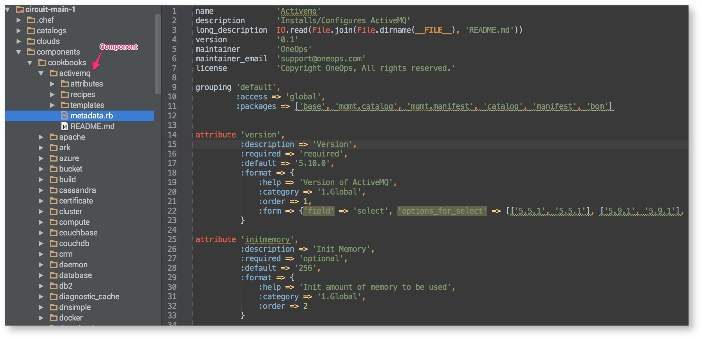
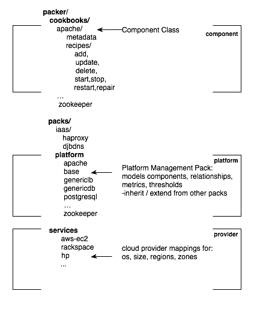
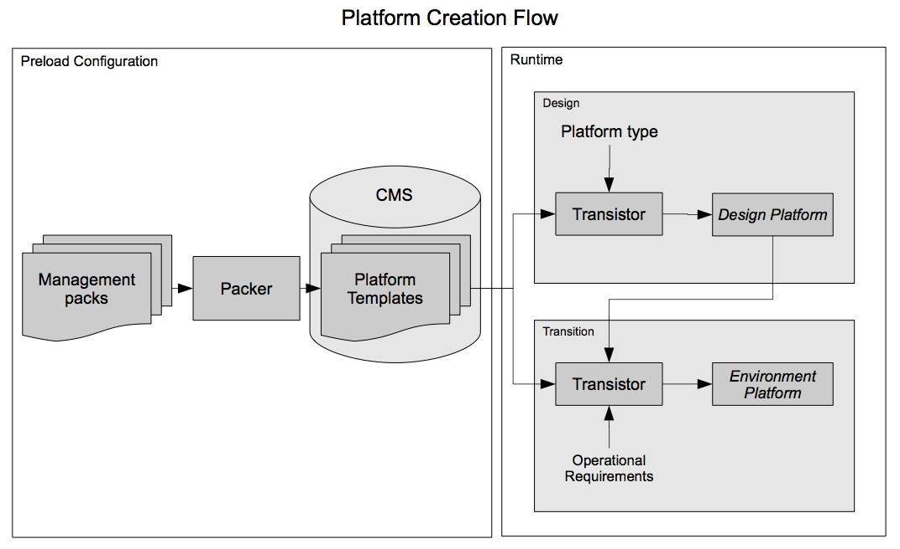
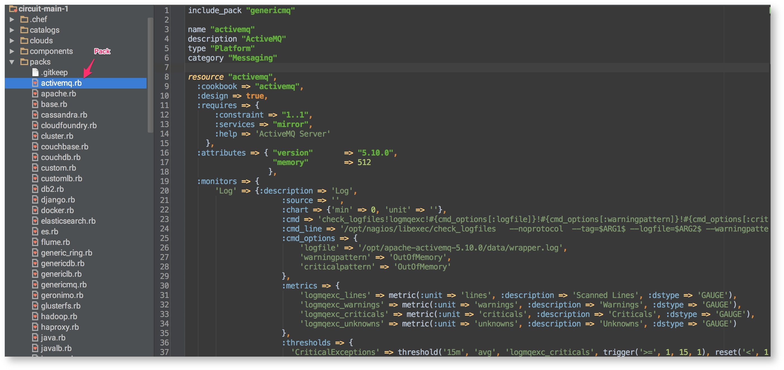
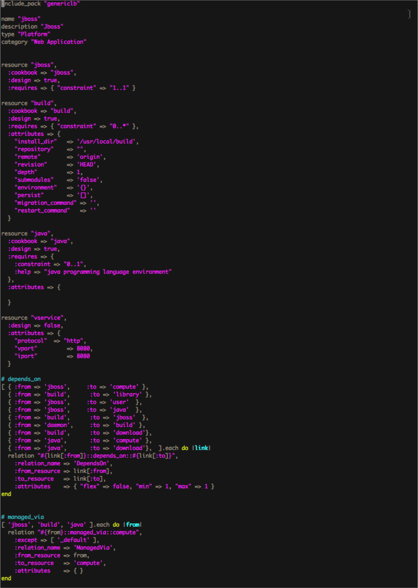

# OneOps System Architecture

As a pack developer , you dont need to know the details of **system architecture** , but if you want to learn more refer [System Architecture](
{{site.baseurl}}/{{site.contexts.admin}}key-concepts/#oneops-system-architecture).

# Model Overview

* [Components](#component) are the lowest level building blocks
* [Platforms](#platform) consist of components and relationships for dependencies and management
* [Assemblies](../#assemblies-api) consist of platforms with interdependencies
* Environments :consist of assemblies plus availability mode components inserted for you

The UI allows customization of components, platforms, assemblies, and environments.

> To add new components or platforms to the system, it is currently necessary to add files to the packer [directory structure.](#model-directory-structure)

# Model and Schema

* Classes
  * All of the metadata in the OneOps system is class-like
  * Class metadata is loaded into the Configuration Management System (CMS) by the Packer
  * Class methods are backed by Recipes
  * Classes are identified by names and attributes
  * Classes belong to packages
  * Packages are related to workflow
* Catalog.* = Design Phase
* Manifest.* = Transition Phase
* Bill of Materials (BOM.*) = Operational Phase

## Catalog Design Relations

In the Design aspect, we model the base application with:

* No environmental
* No operational components

For a Design relations diagram, see [Relations](#relations) in the Reference section.

## Transition Relations

In the Transition aspect, we model two additional objects:

* **IaaS components:** Can be load balancers (`haproxy`) or DNS (`djbdns`). Can also use provider-based ones like `route-53`, `dyndns`, `elb`, etc.
* **Monitors:** Use to customize monitors for each environment

For a Transition relations diagram, see [Relations](#transition) in the Reference section.

## Bill of Materials Operational Relations

In the Operations aspect, we create `bom` components for the manifest components with relation to the Binding (cloud provider). For a operational relations diagram, see [Relations](#operations) in the Reference section.

# Component

A Component is a cookbook directory and the lowest level building block that is modeled. There are three aspects of a Component:

* **Component Class:** Attribute and idempotent `add`, `update`, `delete`, `start`, `stop` logical operators
* **Component Resource:** Used in a [Platform Management Pack](#platform-management-pack) to map the Component class to a component in a platform that is available in the UI
* **Component Instance:** Component instance in an Environment.

The [Relational Model](#relationships) shows how a Component is modeled in Design, Transition, and Operations with regard to aspects of the OneOps UI.

A Component is a basic building block of a OneOps platform. A OneOps component is a chef-solo cookbook with its UI components and actions defined in a cookbook's `metadata.rb`.  For example: Compute, Secgroup, Volume, User, Java, Tomcat, Artifact, etc.



## Model Directory Structure

OneOps extends Chef's Ruby-based DSL and reuses their directory structure.

OneOps adds `packs`, an extensible object-oriented management model, that contains:

* Relationships with flex/scale attributes
* Monitors and attribute defaults
* Metrics and thresholds/triggers to repair, scale, notify only
* Providers for compute, DNS, etc.



## CMS Sync

To update the CMS database with new component metadata and/or platform management packs, we extended Chef's knife to load (model sync) the files in the directory to the database.



## Component Class

Component Class is the lowest-level configuration entity of OneOps metadata and:

* Is defined by name, attributes and methods
* Includes the notion of simple inheritance
* Is backed by a Chef cookbook
* Has attribute metadata (such as type, default values, format, etc) defined in the cookbook's `metadata.rb` file
* Has all related methods (such as add, update, delete, etc) are defined as Chef recipes
* Has attributes and idempotent control code (chef recipes) to manage its lifecycle
* Has control/recipes: `add`, `update`, `delete`, `start`, `stop`, `restart`, `status`, `repair`, `custom`

Example components are: `cassandra`, `compute`, `rabbitmq`, `storage`, `php`. For more detail, view [the full component list](#component-list).

A Component Class must have:

* Cookbook and Packer: See [Model Directory Structure.](#model-directory-structure)
* [Metadata:](#metadata) Model that describes attributes, help, default values
* [Recipes:](#recipe) `add`, `update`, `delete`, `start`, `stop`, `restart`, `repair`

For instructions on how to add a new component, see [Add a New Component.](../howto/#add-a-new-component)

## Component Resource

Component resource mappings are covered in the sections, [Platforms](#platform) and [Platform Management Packs.](../#platform-management-pack).

## Metadata

Metadata models a [component.](#component) The metadata.rb file contains information that is primarily used for the OneOps UI to provide information to the user and collect configuration information from the user. The file has several parts:

* `base/required` Attributes (name, description, etc.)
* `grouping` Sub-groups of attributes CMS models. For an example, see [Metadata.](#metadata)
* `attributes` Defaults, format: UI metadata
* `recipes` Default actions. Add, update and delete are assumed and do not need to be added. Actions can also be added via the UI as on-demand attachments.

## Relationships

We also model relationships. A relationship describes a dependency order between components. For additional detail, refer to [Relations.](#relations)


## Relation Class

The Relation Class defines which [Component](../#component) types that it can establish relationships with. Like the [Component Class,](../#component-class) the Relation Class is identified by names and attributes.

# Platform

A Platform is a collection of [components](#component) that are grouped for reusability.
These are building blocks to create applications via the UI by adding platforms to an [assembly.](#assemblies-api)

#Circuit

Circuit is a ruby application (packaged as gem) that loads Component Classes,Relation Classes and Platform Templates defined in pack files into the Configuration Management System(CMS) database.

# Platform Pack

A Pack (circuit) is a collection of components with dependencies defined between them. The dependency relation is used to define the execution order (for example, when and where to execute these components). Essentially, packs are how you wire components together. Packs include:

* Pack structure
* Inheritance
* Pack upload

Packs also contain configuration for:

* Cloud service dependency
* Component cardinality constraints
* Default attribute values
* Monitor and threshold definitions
* Custom payload details
* Flex relations
* Entry point information and different relationships like:
  * `depends_on`
  * `managed_via`
  * `secured_by`

Packs are used to define OneOps platforms. For example: <a href="{{site.baseurl}}/{{site.contexts.user}}#platform-packs" target="_blank">Tomcat, Apache, NodeJS, Couchbase, Postgres,</a> etc.



# Platform Management Pack

A Platform Template is added to the system by creating a Platform Management Pack (Pack) file and loading it into the CMS. A Pack is a Ruby DSL file that models a platform with respect to each availability mode. It exists in the model directory structure.

The file contains three parts:

* Component Resources: Named resources with a type (cookbook attribute). See the Component Class name in the sample pack below.
* Relationships/dependencies with flexing/scaling attributes
* (Optional) Metrics and Thresholds

The Platform Management Pack defines how corresponding Platforms should look, how they should be deployed, and how they function in different operational Environments. It defines required and optional [Component Classes](#component-class) for the Platform based on SLA requirements. It can also define the default values for [Component](../#component) attributes. In OneOps terms, the Platform Management Pack is analogous to the Platform Factory definition. Management Packs are defined using OneOps’ proprietary Ruby-based DSL.

## Sample New Platform Pack

* Inherit: `include_pack`
* Name, description, category
* Resources: Named Components
* Relations: `depends_on` `managed_via`



## Pack Creation


## Inheritance

A platform can inherit one or more additional packs by using `include_pack`

For example:

````
include_pack 'generic_ring'
````

## Properties

A platform contains properties that are used in a variety of ways to include the OneOps UI. Examples include:

* **Name:** `couchbase`
* **Description:** `CouchBase`
* **Type:** `Platform`
* **Category:** `Database NoSQL`

## Resource

A resource is a component that may be used in a pack.

## Uploading Packs

The OneOps Packer is a Ruby-based application that loads Component Classes, Relation Classes and Platform templates from Platform Management Packs into the Configuration Management System (CMS) database.

# Component and Pack Validations

* Chef node
* Basic payload
* Dynamic payload

# Cloud Service Types

* **Mandatory:** Packs that depend on such services cannot be enabled (deployed) unless the required service is present in the cloud. For example: a compute service is required by most packs to provision computes.
* **Optional:** Packs that depend on such services can be enabled even when the associated service is absent in the cloud. For example: NTP service is optional in compute deployment. If the cloud service is present and the associated component has this service enabled, then deployment makes use of this service.

# OneOps Clouds

TBD add additional cloud information.

A OneOps cloud can be defined as a logical group of [cloud services](#cloud-service-types) that enable resource allocation/usage. Typically a cloud contains:

* Compute provisioning service: Openstack, Rakespace, etc.
* DNS provisioning service: Infoblox, etc.
* Repository with packages/repositories/application-artifacts: Nexus, etc.

OneOps creates multiple clouds per organization. Currently clouds are based on the availability zone that is created by the elastic cloud team per data center.

# OneOps and Chef

<a href="http://docs.chef.io" target="_blank">Chef</a> is a Ruby-based DSL for systems administration of Unix or Windows systems by Opscode. As a configuration management tool, Chef uses a pure-Ruby, domain-specific language (DSL) for writing system configuration "recipes" or "cookbooks". Chef is released as open source under the Apache License 2.0.

## Cookbook

<a href="http://docs.chef.io/cookbooks.html" target="_blank">Cookbook</a> is the fundamental unit of configuration and policy distribution. A cookbook defines a particular scenario, for example, everything needed to install and configure Apache or Tomcat server and the resources that support that.

## Recipe

<a href="http://docs.chef.io/recipes.html" target="_blank">Recipe</a> describes configuration conditions. A recipe is stored in a cookbook and declares everything that is required to configure part of a system. For example, a recipe can:

* Install and configure software components
* Manage files
* Deploy applications
* Run other recipes
* Perform component lifecycle actions like add, update, and delete

## Build

Most platforms have an optional Build Component. This allows you to add your code via Git or SVN. It extends the Chef deploy resource and adds many features.
