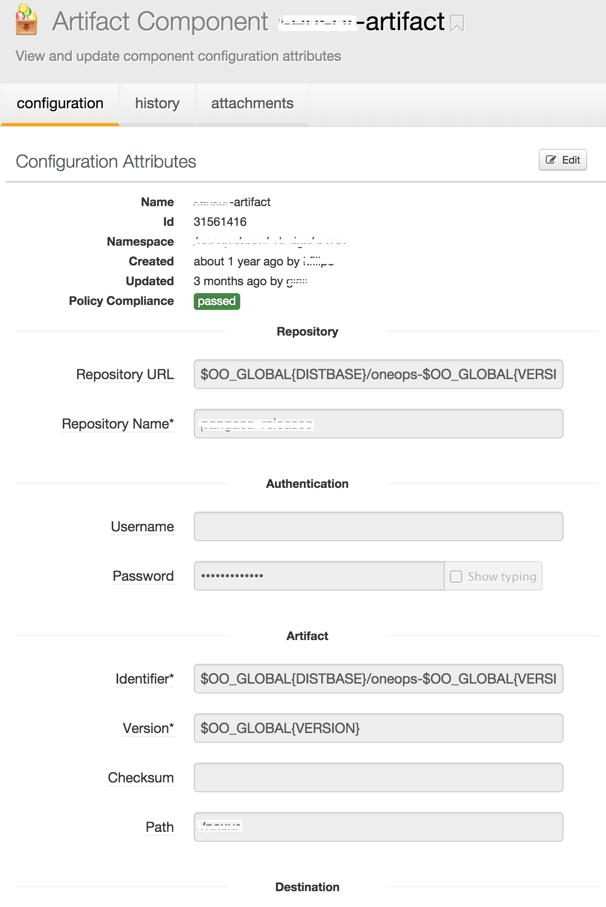

Variables are a way to set key-value pair for easy referencing. They allow you to set one value and have it used across many Components. An example use for Variables would be to create a revision tag across your builds.

<video width="720" height="480" preload="metadata" controls="" class="grovo-video">
    <source src="http://videos.grovo.com/walmart-oneops-0215_adding-variables-to-your-design_4668.webm?vpv=1" type="video/webm">
    Your browser does not implement HTML5 video. 
</video>

To add a variable, follow these steps:

1. In Design, select an Assembly.
2. Select the **variables** tab.
3. Click **New Variable.**
4. Enter a unique name.
  * Letters, numbers, and dashes are allowed. No other characters are allowed.
  * If you use invalid characters, you are notified to match the requested format.
5. Enter a value for the variable.
  

The three areas to store variables are: Cloud, Global and Local.

* Cloud variables are defined for a particular Cloud and referenced as $OO_CLOUD{vairable-name}
* Global variables are those set in a particular Assembly. Such variables are available across all platforms in an Assembly. These can be referred as $OO_GLOBAL{vairable-name}
* Local variables are those set in a particular Platform. The variable is available only to the components within the platform. Usage $OO_LOCAL{variable-name}

At the time of deployment, these variables are substituted with the actual values. 

There are 3 implicit variables available which can be directly used in any component attribute 
* $OO_GLOBAL{env_name} : resolves to environment name
* $OO_CLOUD{cloud_name} : resolves to cloud name
* $OO_LOCAL{platform_name} : resolves to platform name

# See Also

[Variable Override] (#variables-override-prevention)

  

