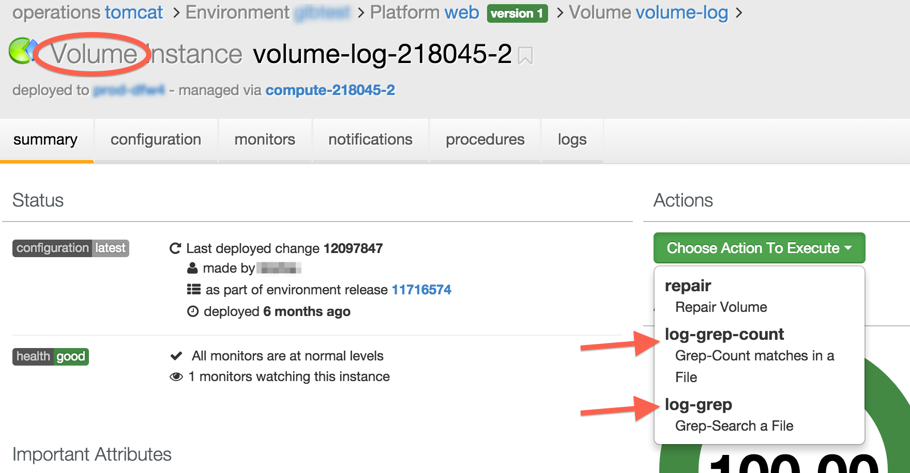
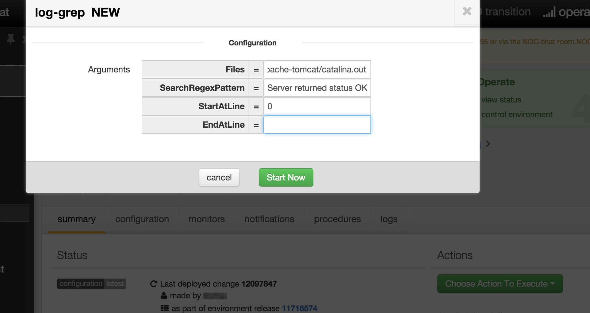
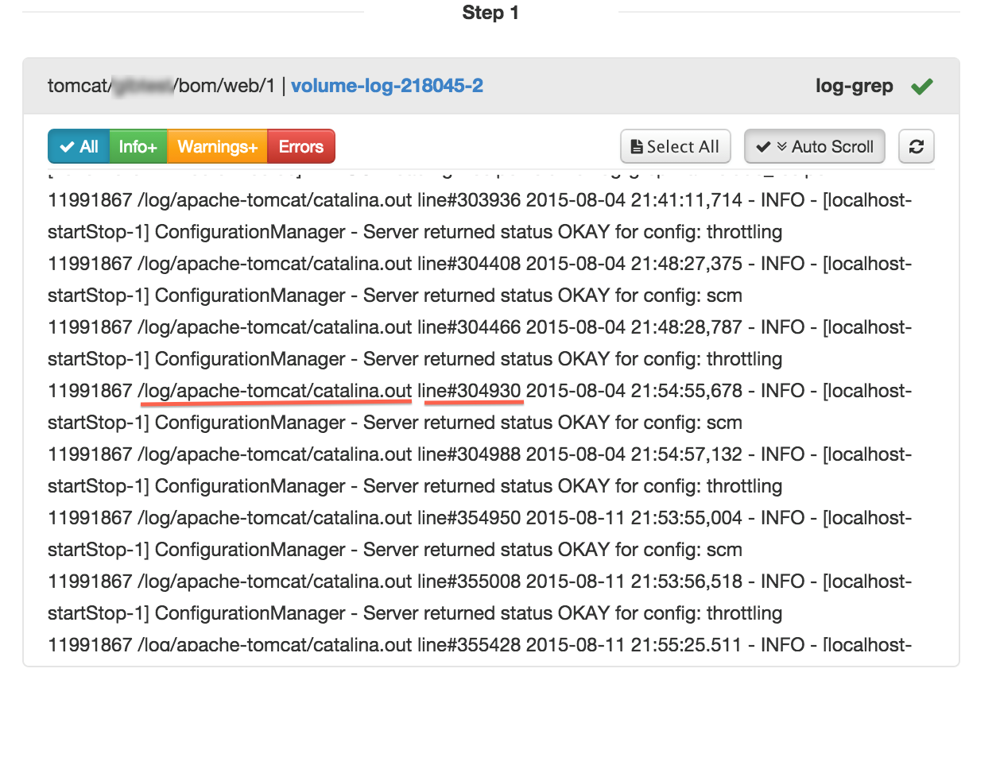
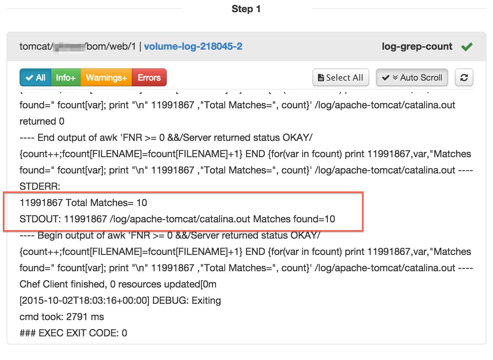

# Solution

OneOps has a couple of actions available on "Volume" components to help text-search one or multiple files on a compute.

* **log-grep:** You can search a regex text in one or multiple files. The result of the grep search is printed on the action execution log.
* **log-grep-count:** Same as above but the result printed is the total number of lines matched in each files and not the actual matched text content.

## Action Location

1. Go to the operations of any volume component and find the two actions in the actions drop-down menu as shown below. 
2. Alternatively, go one level up and select multiple volume component objects and execute the actions on all of them at the same time.

## Action Parameters Window

1. It is necessary to enter two mandatory arguments:
  * Files (Use the absolute file path in which you want to search a regex. If you have multiple files to search in, separate their full paths with a space)
  * Search Regex Pattern
2. There are also two optional arguments to specify at what line # the search should start and at what line it should end. By default, it searches the whole file or files.

 
## log-grep Action Result

As shown below, the result of the log-grep action is printed on the output of the action execution. For each match, it prints the name of the file followed by the line # matched and then the actual line.

## log-grep-count Action Result

As shown below, the result of the log-grep-count action is printed on the output of the action execution. It prints the filename followed by the total number of lines matched. 

